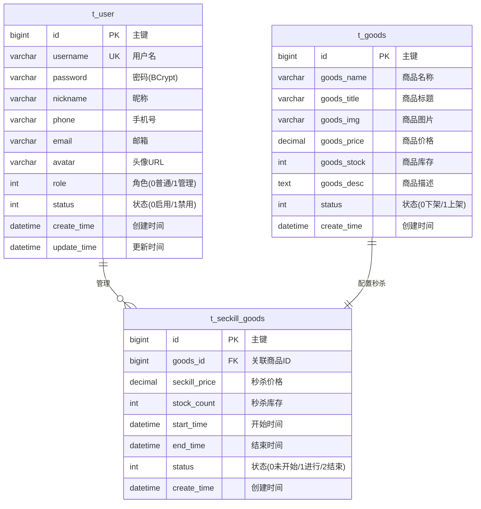
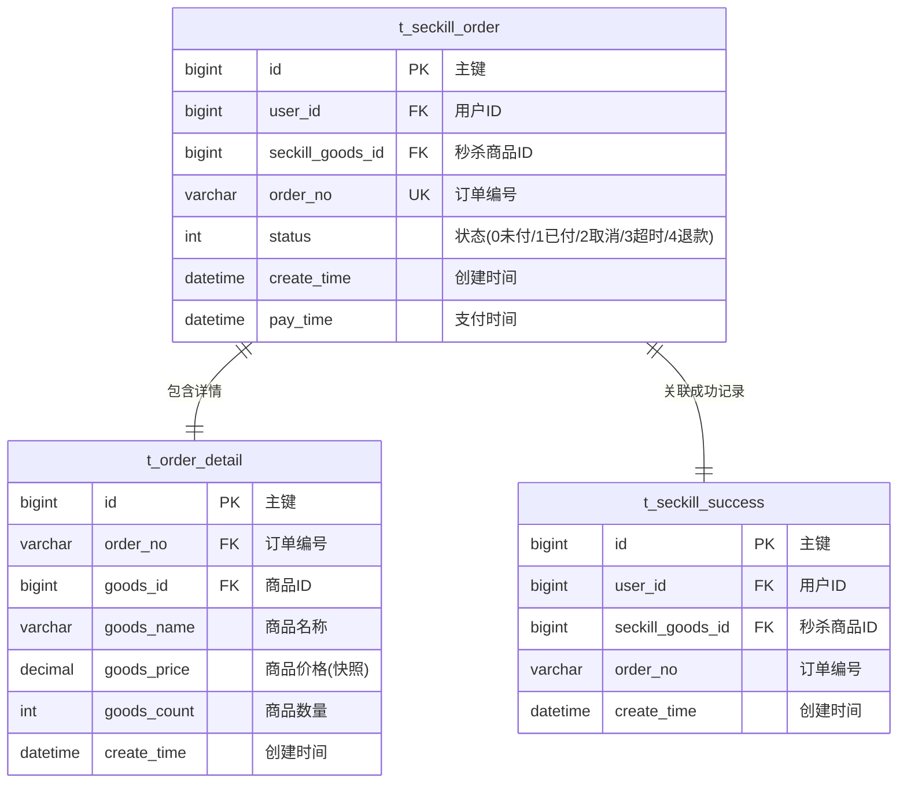
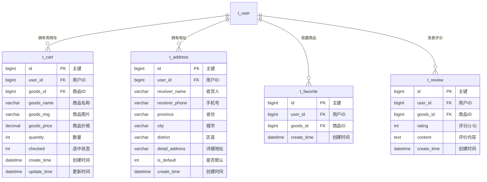
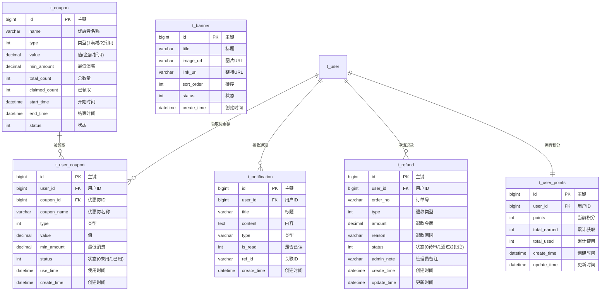

# 基于Spring Boot的高并发秒杀商城系统设计与实现

## 摘要

随着电子商务的快速发展，限时秒杀已成为各大电商平台吸引用户、提升销量的重要营销手段。然而，秒杀场景下的高并发访问、超卖风险、系统稳定性等问题对技术架构提出了严峻挑战。本文设计并实现了一个基于Spring Boot的高并发秒杀商城系统，采用多层防护架构应对秒杀场景下的并发压力。

系统后端基于Java 17和Spring Boot 2.7.18框架，集成MyBatis-Plus实现数据持久化，使用Redis进行高速缓存和库存预扣减，通过RabbitMQ消息队列实现异步下单，结合Redisson分布式锁保证集群环境下的数据一致性。前端采用Vue 3 + Element Plus构建PC端管理后台和用户界面，同时基于uni-app框架实现微信小程序端，满足多终端访问需求。

系统实现了用户认证与授权、商品管理、秒杀活动管理、购物车、订单管理、优惠券、积分、退款、消息通知等完整的电商功能模块。在秒杀核心流程中，通过验证码防护、全局限流、用户级限流、本地缓存、Redis售罄检查、重复购买校验、原子库存扣减、消息队列异步下单、数据库乐观锁、前端轮询等10层防护机制，有效保障了系统在高并发场景下的稳定性和数据一致性。

测试结果表明，系统在模拟高并发秒杀场景下能够正确处理库存扣减，有效防止超卖现象，订单创建成功率达到预期目标，系统响应时间满足用户体验要求。

**关键词：** 秒杀系统；Spring Boot；Redis；RabbitMQ；高并发；分布式架构

---

## Abstract

With the rapid development of e-commerce, flash sales have become an important marketing strategy for major e-commerce platforms to attract users and boost sales. However, high-concurrency access, overselling risks, and system stability issues in flash sale scenarios pose severe challenges to technical architecture. This paper designs and implements a high-concurrency flash sale mall system based on Spring Boot, adopting a multi-layer protection architecture to handle concurrent pressure in flash sale scenarios.

The backend is based on Java 17 and Spring Boot 2.7.18 framework, integrating MyBatis-Plus for data persistence, using Redis for high-speed caching and inventory pre-deduction, implementing asynchronous order creation through RabbitMQ message queue, and combining Redisson distributed locks to ensure data consistency in cluster environments. The frontend uses Vue 3 + Element Plus to build the PC management backend and user interface, while implementing the WeChat mini-program based on the uni-app framework to meet multi-terminal access needs.

The system implements complete e-commerce functional modules including user authentication and authorization, product management, flash sale activity management, shopping cart, order management, coupons, points, refunds, and message notifications. In the core flash sale process, through 10 protection mechanisms including captcha verification, global rate limiting, user-level rate limiting, local caching, Redis sold-out checking, duplicate purchase verification, atomic inventory deduction, message queue asynchronous ordering, database optimistic locking, and frontend polling, the system effectively ensures stability and data consistency under high-concurrency scenarios.

Test results show that the system can correctly handle inventory deduction in simulated high-concurrency flash sale scenarios, effectively preventing overselling, with order creation success rate meeting expected targets and system response time satisfying user experience requirements.

**Keywords:** Flash Sale System; Spring Boot; Redis; RabbitMQ; High Concurrency; Distributed Architecture

---

## 第一章 绪论

### 1.1 研究背景与意义

近年来，随着互联网技术的飞速发展和移动支付的普及，电子商务行业呈现出爆发式增长态势。根据中国互联网络信息中心（CNNIC）发布的统计报告，截至2025年，我国网络购物用户规模已超过9亿，网络零售额连续多年保持两位数增长。在激烈的市场竞争环境下，各大电商平台纷纷推出各种营销活动以吸引用户、提升销量，其中"限时秒杀"作为一种高效的价格促销手段，已成为电商平台的标准配置。

秒杀（Flash Sale）是指在限定时间内，以极低的价格销售限量商品的营销活动。其核心特点是：时间短（通常几分钟到几小时）、价格低（通常为原价的1-3折）、数量少（通常几十到几百件）。这种模式能够有效激发用户的购买欲望，制造稀缺感和紧迫感，从而在短时间内聚集大量流量和订单。

然而，秒杀活动对系统技术架构提出了严峻挑战：

1. **瞬时高并发**：秒杀开始瞬间，大量用户同时发起请求，系统需要承受远超日常水平的并发压力。以一个中等规模的电商平台为例，一场秒杀活动可能在1秒内收到数万甚至数十万个请求。

2. **超卖风险**：在高并发场景下，如果库存扣减操作不是原子性的，可能导致多个用户同时成功购买同一件商品，造成实际售出数量超过库存数量的"超卖"现象。

3. **系统稳定性**：瞬时的流量洪峰可能导致数据库连接池耗尽、服务器内存溢出、响应时间急剧增加等问题，严重时可能导致整个系统瘫痪。

4. **用户体验**：在高并发场景下，如何保证用户能够快速得到响应（无论是成功购买还是库存不足的提示），而不是长时间等待或看到错误页面，是提升用户体验的关键。

因此，设计一个能够有效应对高并发挑战、保证数据一致性、提供良好用户体验的秒杀系统，具有重要的理论意义和实际应用价值。

### 1.2 国内外研究现状

在秒杀系统的技术实现方面，国内外学者和工程师已经进行了大量的研究和实践。

**国外研究现状：**

Amazon、eBay等国际电商巨头在高并发系统架构方面积累了丰富的经验。Amazon提出的"两个披萨团队"原则和微服务架构思想，对高并发系统的设计产生了深远影响。Netflix开发的Hystrix熔断器、Eureka服务发现等组件，为分布式系统的容错处理提供了成熟的解决方案。此外，Redis、Kafka、Elasticsearch等开源技术的广泛应用，为构建高性能的电商系统提供了强大的技术支撑。

**国内研究现状：**

阿里巴巴、京东、拼多多等国内电商企业在秒杀系统方面有着丰富的实战经验。阿里巴巴的"双11"购物节每年都会创造新的交易记录，其背后的技术架构经历了从单体应用到分布式微服务的演进过程。京东的秒杀系统采用了多级缓存、异步化、限流削峰等技术手段，有效应对了高并发场景。拼多多则通过社交裂变的模式，将秒杀活动与社交分享相结合，创造了独特的营销方式。

在学术研究方面，国内多所高校的研究团队对秒杀系统的关键技术进行了深入研究。例如，针对库存扣减的并发控制问题，提出了基于Redis原子操作的预扣库存方案；针对订单创建的性能瓶颈，提出了基于消息队列的异步下单方案；针对系统限流的需求，提出了基于滑动窗口的分布式限流算法等。

### 1.3 研究内容与目标

本文的研究内容主要包括以下几个方面：

1. **需求分析**：对秒杀商城系统的功能需求和非功能需求进行详细分析，明确系统的业务流程和技术指标。

2. **系统设计**：设计系统的整体架构、数据库结构、接口规范和安全策略，确保系统具有良好的可扩展性、可维护性和安全性。

3. **核心功能实现**：实现用户管理、商品管理、秒杀活动管理、购物车、订单管理、优惠券、积分、退款、消息通知、评价等核心功能模块。

4. **AI智能助手**：集成阿里云百练平台（通义千问大模型），实现AI购物助手功能，为用户提供智能问答、商品推荐、订单咨询等服务。

5. **秒杀流程优化**：设计并实现10层防护架构，包括验证码防护、限流、缓存、消息队列、乐观锁等技术手段，确保秒杀流程的高并发处理能力和数据一致性。

6. **多端适配**：基于Vue 3和uni-app框架，分别实现PC端和微信小程序端的前端界面，满足不同终端用户的访问需求。

7. **系统测试**：对系统进行功能测试、性能测试和安全测试，验证系统的正确性、稳定性和安全性。

本文的研究目标是设计并实现一个功能完善、性能优良、安全可靠的秒杀商城系统，为电商平台的秒杀活动提供技术支撑，同时为类似高并发系统的设计和实现提供参考。

### 1.4 论文组织结构

本文共分为六章，各章内容安排如下：

第一章：绪论。介绍研究背景与意义、国内外研究现状、研究内容与目标以及论文组织结构。

第二章：相关技术介绍。介绍系统开发所使用的关键技术，包括Spring Boot、MyBatis-Plus、Redis、RabbitMQ、Redisson、Vue 3、uni-app等。

第三章：系统需求分析。对系统的功能需求和非功能需求进行详细分析，绘制用例图和业务流程图。

第四章：系统设计。设计系统的整体架构、数据库结构、接口规范和安全策略。

第五章：系统实现。详细介绍各功能模块的实现过程，重点阐述秒杀核心流程的技术实现方案。

第六章：系统测试与总结。对系统进行功能测试、性能测试和安全测试，总结研究成果并展望未来工作。

---

## 第二章 相关技术介绍

### 2.1 Spring Boot框架

Spring Boot是由Pivotal团队开发的基于Spring框架的快速开发脚手架，旨在简化Spring应用的创建、配置和部署过程。Spring Boot的核心特性包括：

1. **自动配置（Auto-Configuration）**：Spring Boot能够根据项目中引入的依赖自动配置Spring应用，大大减少了手动配置的工作量。例如，当项目中引入了`spring-boot-starter-web`依赖时，Spring Boot会自动配置嵌入式Tomcat服务器、Spring MVC、JSON序列化等组件。

2. **起步依赖（Starter Dependencies）**：Spring Boot提供了一系列预定义的起步依赖，每个起步依赖都包含了一组相关库的特定版本组合，解决了依赖版本冲突的问题。例如，`spring-boot-starter-data-redis`包含了Spring Data Redis、Lettuce客户端等依赖。

3. **嵌入式服务器**：Spring Boot支持将Web服务器（如Tomcat、Jetty、Undertow）嵌入到应用中，使得应用可以直接以jar包形式运行，无需外部容器。

4. **Actuator监控**：Spring Boot Actuator提供了丰富的端点（Endpoints），用于监控和管理应用的运行状态，包括健康检查、指标收集、环境信息等。

本系统采用Spring Boot 2.7.18版本作为后端开发框架，充分利用其自动配置和起步依赖特性，快速搭建了RESTful API服务。

### 2.2 MyBatis-Plus

MyBatis-Plus是一个MyBatis的增强工具，在MyBatis的基础上只做增强不做改变，为简化开发、提高效率而生。MyBatis-Plus的核心特性包括：

1. **通用CRUD**：提供了通用的Mapper和Service接口，内置了单表的增删改查方法，无需编写XML映射文件。

2. **条件构造器**：提供了LambdaQueryWrapper和LambdaUpdateWrapper等条件构造器，支持链式调用，使得查询条件的构建更加简洁和类型安全。

3. **分页插件**：内置了分页插件，支持多种数据库的物理分页，使用简单方便。

4. **代码生成器**：提供了代码生成器，可以根据数据库表自动生成Entity、Mapper、Service、Controller等代码。

5. **乐观锁插件**：提供了乐观锁插件，支持在更新操作中使用版本号机制防止并发冲突。

本系统使用MyBatis-Plus 3.5.5版本，采用注解方式定义SQL（无XML映射文件），利用条件构造器简化查询代码，使用乐观锁插件保证秒杀库存扣减的并发安全。

### 2.3 Redis

Redis（Remote Dictionary Server）是一个开源的、基于内存的键值对数据库，支持多种数据结构，包括字符串（String）、哈希（Hash）、列表（List）、集合（Set）、有序集合（Sorted Set）等。Redis的核心优势包括：

1. **高性能**：Redis将数据存储在内存中，读写速度极快，单机QPS可达10万以上。

2. **丰富的数据结构**：Redis支持多种数据结构，能够满足不同业务场景的需求。

3. **持久化**：Redis支持RDB和AOF两种持久化方式，可以将内存中的数据保存到磁盘，防止数据丢失。

4. **原子操作**：Redis的所有操作都是原子性的，支持事务、Lua脚本等机制，能够保证并发场景下的数据一致性。

5. **过期机制**：Redis支持为键设置过期时间，到期后自动删除，非常适合用于缓存和会话管理。

本系统将Redis用于以下场景：

- **秒杀库存预扣减**：利用Redis的原子递减操作（DECR）实现高并发场景下的库存预扣减，避免直接访问数据库。
- **用户会话管理**：存储用户的JWT Token和会话信息，支持分布式环境下的用户认证。
- **验证码存储**：存储图形验证码的答案，设置5分钟过期时间。
- **限流计数器**：基于Redis的原子递增操作和过期机制，实现用户级和IP级的请求限流。
- **业务缓存**：缓存商品列表、商品详情、购物车、收藏列表等热点数据，减少数据库访问压力。
- **分布式锁**：通过Redisson客户端实现分布式锁，保证集群环境下的数据一致性。

### 2.4 RabbitMQ

RabbitMQ是一个开源的消息代理软件，实现了高级消息队列协议（AMQP）。RabbitMQ的核心特性包括：

1. **消息可靠性**：RabbitMQ支持消息确认机制、持久化机制和事务机制，能够保证消息的可靠传递。

2. **灵活的路由**：RabbitMQ支持多种交换机类型（Direct、Fanout、Topic、Headers），能够实现灵活的消息路由。

3. **高可用性**：RabbitMQ支持集群部署和镜像队列，能够提供高可用性的消息服务。

4. **死信队列**：RabbitMQ支持死信队列（Dead Letter Queue），可以将消费失败的消息路由到专门的队列进行处理。

本系统将RabbitMQ用于秒杀订单的异步创建。当用户成功秒杀商品后，系统将订单消息发送到RabbitMQ，由消费者异步处理订单创建逻辑。这种异步化设计的优势包括：

- **削峰填谷**：将瞬时的订单创建请求转化为消息队列中的消息，由消费者按照自己的处理能力逐步消费，避免数据库被瞬时的写入压力压垮。
- **重试机制**：消费失败的消息可以重新入队进行重试，提高订单创建的成功率。
- **死信处理**：多次重试仍然失败的消息会被路由到死信队列，便于人工处理和问题排查。

本系统配置了主队列、重试队列和死信队列的三级队列结构，实现了消息的自动重试和死信处理。

### 2.5 Redisson

Redisson是一个基于Redis的Java驻内存数据网格（In-Memory Data Grid）和分布式服务框架。Redisson提供了丰富的分布式对象和服务，包括：

1. **分布式锁**：Redisson提供了可重入的分布式锁（RLock），支持公平锁、读写锁、联锁等多种锁类型。

2. **分布式集合**：提供了分布式的Map、Set、List、Queue等集合类型。

3. **分布式服务**：提供了分布式远程服务（RPC）、分布式任务调度、分布式限流器等服务。

4. **与Spring集成**：Redisson提供了与Spring Boot的自动集成，使用简单方便。

本系统使用Redisson实现以下功能：

- **分布式锁**：在管理员补充库存、修改秒杀活动状态等操作中，使用分布式锁保证同一时间只有一个实例能够执行操作。
- **订单超时取消**：在订单超时取消的定时任务中，使用分布式锁保证集群环境下只有一个实例执行取消操作，避免重复处理。

### 2.6 Caffeine本地缓存

Caffeine是一个高性能的Java本地缓存库，由Google的Guava Cache演化而来。Caffeine的核心特性包括：

1. **高性能**：Caffeine使用了Window TinyLfu淘汰算法，在命中率和性能方面优于LRU和LFU算法。

2. **自动加载**：支持同步和异步的缓存加载机制。

3. **过期策略**：支持基于时间的过期（写入后过期、访问后过期）和基于容量的淘汰。

4. **统计信息**：提供缓存命中率、加载时间等统计信息。

本系统使用Caffeine作为一级本地缓存，Redis作为二级远程缓存，构建了多级缓存架构。热点数据（如秒杀商品列表）优先从Caffeine本地缓存读取，未命中时再从Redis读取，最后才访问数据库。这种多级缓存架构能够有效减少数据库访问压力，提高系统响应速度。

### 2.7 Vue 3框架

Vue 3是一个渐进式的JavaScript框架，用于构建用户界面。Vue 3的核心特性包括：

1. **组合式API（Composition API）**：Vue 3引入了组合式API，提供了更灵活的代码组织方式，使得逻辑复用更加方便。

2. **响应式系统**：Vue 3使用Proxy实现响应式系统，相比Vue 2的Object.defineProperty，提供了更好的性能和更完整的响应式支持。

3. **更好的TypeScript支持**：Vue 3从底层对TypeScript提供了更好的支持。

4. **性能优化**：Vue 3在虚拟DOM、编译器、树摇等方面进行了优化，提供了更好的运行时性能。

本系统的PC前端基于Vue 3.4版本开发，使用Vite 5作为构建工具，Element Plus作为UI组件库，Pinia作为状态管理库，Vue Router作为路由管理库。

### 2.8 uni-app框架

uni-app是一个使用Vue.js开发所有前端应用的框架，可以编译到iOS、Android、Web（响应式）、以及各种小程序平台。uni-app的核心特性包括：

1. **跨平台开发**：使用一套代码可以编译到多个平台，大大提高了开发效率。

2. **丰富的组件**：提供了丰富的内置组件，覆盖了常见的UI需求。

3. **条件编译**：支持条件编译，可以针对不同平台编写特定的代码。

4. **原生渲染**：在小程序平台使用原生渲染，在App平台支持Weex渲染，保证了良好的性能。

本系统的小程序前端基于uni-app框架开发，使用Vue 3和Pinia，编译到微信小程序平台。

### 2.9 Spring Security与JWT

Spring Security是一个功能强大、高度可定制的安全框架，提供了认证（Authentication）和授权（Authorization）功能。本系统使用Spring Security实现以下安全功能：

1. **用户认证**：基于JWT（JSON Web Token）实现无状态的用户认证。用户登录成功后，服务器生成JWT Token返回给客户端，客户端在后续请求中携带Token进行身份验证。

2. **权限控制**：基于角色的访问控制（RBAC），区分普通用户和管理员角色，通过`@PreAuthorize`注解和路径匹配规则控制接口访问权限。

3. **密码加密**：使用BCrypt算法对用户密码进行加密存储，保证密码安全。

JWT是一种开放标准（RFC 7519），定义了一种紧凑、自包含的方式，用于在各方之间安全地传输信息。本系统使用jjwt库实现JWT的生成和验证，Token有效期设置为24小时。

### 2.10 阿里云百练平台（DashScope）

阿里云百练平台是阿里云推出的大模型服务平台，提供通义千问等多种大语言模型的API访问能力。本系统集成百练平台实现AI购物助手功能，主要特点包括：

1. **智能问答**：基于通义千问大模型，能够理解用户的自然语言问题并给出智能回答。

2. **多轮对话**：支持上下文记忆的多轮对话，能够理解用户意图的连续性。

3. **降级处理**：当AI服务不可用时，系统自动降级为基于关键词匹配的规则回复，保证服务可用性。

4. **对话历史**：使用Redis存储用户的对话历史，支持跨会话的上下文连续。

本系统使用DashScope Java SDK（dashscope-sdk-java 2.16.4）调用百练平台API，支持三种模型可选：qwen-turbo（极速，适合简单问答）、qwen-plus（增强，平衡性能与效果）、qwen-max（旗舰，最强能力），默认使用qwen-turbo，最大输出token数为1500。用户可在聊天界面自由切换模型。

---

## 第三章 系统需求分析

### 3.1 功能需求分析

通过对秒杀电商业务的深入分析，本系统的功能需求可以划分为以下几个模块：

#### 3.1.1 用户管理模块

用户管理模块负责用户的注册、登录、个人信息管理等功能。具体需求包括：

- 用户注册：支持用户名、密码、昵称、手机号等信息的注册，用户名需唯一性校验。
- 用户登录：支持用户名密码登录，登录成功返回JWT Token。
- 个人信息管理：支持修改昵称、手机号、邮箱、头像等个人信息，统一在"设置"页面管理。
- 密码管理：支持修改密码（需验证旧密码）和密码重置（忘记密码时使用）。
- 用户登出：支持客户端和服务端双重登出，服务端通过Redis Token黑名单实现即时失效。
- 收货地址管理：支持收货地址的增删改查，支持设置默认地址，省市区采用三级联动选择器。

#### 3.1.2 商品管理模块

商品管理模块负责商品的展示和管理。具体需求包括：

- 商品列表：展示所有上架商品，支持关键词搜索。
- 商品详情：展示商品的详细信息，包括图片、价格、库存、描述等。
- 商品分类：支持按分类浏览商品。
- 商品收藏：支持收藏/取消收藏商品。

#### 3.1.3 秒杀活动模块

秒杀活动模块是系统的核心模块，负责秒杀活动的创建、管理和执行。具体需求包括：

- 秒杀活动管理：管理员可以创建、编辑、删除秒杀活动，设置秒杀价格、库存、开始时间、结束时间等。
- 秒杀活动展示：展示当前进行中、未开始、已结束的秒杀活动。
- 秒杀执行：用户参与秒杀，系统进行验证码校验、限流、库存扣减、订单创建等操作。
- 秒杀结果查询：用户可以查询秒杀结果（排队中、成功、失败）。

#### 3.1.4 购物车模块

购物车模块负责用户购物车的管理。具体需求包括：

- 添加商品：将商品添加到购物车，支持数量选择。
- 购物车列表：展示购物车中的商品，支持选中/取消选中、数量修改、删除等操作。
- 全选/取消全选：支持一键全选或取消全选。
- 库存校验：添加商品和修改数量时校验库存是否充足。

#### 3.1.5 订单管理模块

订单管理模块负责订单的创建、支付、取消和查询。具体需求包括：

- 订单创建：秒杀成功后自动创建订单。
- 订单支付：支持模拟支付操作。
- 订单取消：支持用户主动取消未支付订单，取消后回滚库存。
- 订单删除：支持删除已取消、已超时、已退款的订单记录。
- 订单超时：超过15分钟未支付的订单自动取消并回滚库存。
- 订单查询：支持查看订单列表和订单详情，支持按状态筛选。
- 订单导出：管理员可以导出订单数据为Excel文件。

#### 3.1.6 优惠券模块

优惠券模块负责优惠券的发放和使用。具体需求包括：

- 优惠券领取：用户可以领取可用的优惠券。
- 优惠券列表：展示用户已领取的优惠券。
- 优惠券使用：在下单时使用优惠券（预留功能）。

#### 3.1.7 积分模块

积分模块负责用户积分的管理和记录。具体需求包括：

- 积分查询：查询用户当前积分和积分明细。
- 积分获取：购物、签到等行为获得积分（预留功能）。
- 积分使用：积分抵扣、兑换等（预留功能）。

#### 3.1.8 退款模块

退款模块负责退款申请和处理。具体需求包括：

- 退款申请：用户可以对已支付订单申请退款。
- 退款审核：管理员可以审批退款申请，通过或拒绝。
- 退款回滚：退款通过后自动回滚库存。

#### 3.1.9 消息通知模块

消息通知模块负责系统消息的发送和展示。具体需求包括：

- 通知列表：展示用户的通知消息。
- 未读标记：支持标记单条或全部已读。
- 通知推送：订单状态变更、优惠券到账等场景自动发送通知（预留功能）。

#### 3.1.10 评价模块

评价模块负责商品评价的管理。具体需求包括：

- 发表评价：用户可以对已购买的商品发表评价。
- 评价列表：展示商品的评价列表。
- 我的评价：查看用户自己发表的评价。

#### 3.1.11 管理后台模块

管理后台模块为管理员提供系统管理功能。具体需求包括：

- 数据概览：展示订单统计、销售额、用户数等关键指标。
- 商品管理：商品的增删改查、库存补充。
- 秒杀管理：秒杀活动的创建、编辑、状态管理。
- 订单管理：订单列表查看、筛选、导出。
- 用户管理：用户列表、角色修改、启用/禁用。
- 轮播图管理：首页轮播图的增删改查。
- 退款管理：退款申请的审批处理。
- 操作日志：查看系统操作日志。

#### 3.1.12 AI购物助手模块

AI购物助手模块为用户提供智能客服功能。具体需求包括：

- 智能问答：用户可以向AI助手提问，获取购物相关的帮助。
- 模型选择：支持切换不同AI模型（通义千问极速/增强/旗舰），满足不同场景需求。
- 快捷问题：提供常见问题的快捷入口，支持一键发送。
- 对话历史：保存用户的对话历史，支持多会话管理。
- 消息操作：支持复制消息、重新生成回复。
- 降级处理：当AI服务不可用时，提供基于关键词的降级回复。

### 3.2 非功能需求分析

#### 3.2.1 性能需求

- **响应时间**：普通接口响应时间不超过200ms，秒杀接口响应时间不超过500ms。
- **并发能力**：系统应支持至少500 QPS的秒杀请求。
- **库存扣减**：保证库存扣减的原子性，防止超卖现象。

#### 3.2.2 安全需求

- **用户认证**：基于JWT的无状态认证机制。
- **权限控制**：基于角色的访问控制，区分普通用户和管理员。
- **密码安全**：使用BCrypt算法加密存储密码。
- **接口安全**：防SQL注入、XSS攻击、CSRF攻击。
- **限流防护**：对敏感接口（登录、秒杀）进行限流防护。

#### 3.2.3 可靠性需求

- **数据一致性**：保证库存、订单、积分等数据的一致性。
- **消息可靠性**：保证秒杀订单消息的可靠传递，支持重试和死信处理。
- **订单超时**：自动取消超时未支付订单，回滚库存。

#### 3.2.4 可扩展性需求

- **水平扩展**：系统应支持多实例部署，通过分布式锁保证数据一致性。
- **模块化设计**：各功能模块应松耦合，便于独立开发和维护。

#### 3.2.5 兼容性需求

- **多终端支持**：支持PC浏览器和微信小程序两种终端访问。
- **浏览器兼容**：支持主流浏览器（Chrome、Firefox、Safari、Edge）。

---

## 第四章 系统设计

### 4.1 系统架构设计

本系统采用前后端分离的架构设计，整体架构如下：

```
┌─────────────────────────────────────────────────────────────┐
│                        客户端层                              │
│  ┌─────────────────┐  ┌─────────────────┐                   │
│  │   PC前端 (Vue3)  │  │  小程序 (uni-app) │                  │
│  └────────┬────────┘  └────────┬────────┘                   │
│           │                    │                             │
└───────────┼────────────────────┼─────────────────────────────┘
            │                    │
            ▼                    ▼
┌─────────────────────────────────────────────────────────────┐
│                       Nginx反向代理                          │
└───────────────────────────┬─────────────────────────────────┘
                            │
                            ▼
┌─────────────────────────────────────────────────────────────┐
│                    Spring Boot 应用层                        │
│  ┌─────────────────────────────────────────────────────┐   │
│  │              Controller 控制器层                      │   │
│  │  用户 | 商品 | 秒杀 | 订单 | 购物车 | 管理端 | AI    │   │
│  └─────────────────────────────────────────────────────┘   │
│  ┌─────────────────────────────────────────────────────┐   │
│  │              Service 业务逻辑层                      │   │
│  │  用户 | 商品 | 秒杀 | 订单 | 购物车 | 优惠券 | 积分  │   │
│  └─────────────────────────────────────────────────────┘   │
│  ┌─────────────────────────────────────────────────────┐   │
│  │              Mapper 数据访问层                       │   │
│  │              (MyBatis-Plus)                          │   │
│  └─────────────────────────────────────────────────────┘   │
│  ┌─────────────────────────────────────────────────────┐   │
│  │  Security  │  Cache  │  MQ  │  Scheduler  │  AOP    │   │
│  │  (JWT)     │(多级缓存)│(异步) │  (定时任务)  │(日志)   │   │
│  └─────────────────────────────────────────────────────┘   │
└─────────────────────────────────────────────────────────────┘
            │              │              │
            ▼              ▼              ▼
┌──────────────┐  ┌──────────────┐  ┌──────────────┐
│    MySQL     │  │    Redis     │  │   RabbitMQ   │
│   (持久化)    │  │  (缓存/锁)   │  │  (消息队列)  │
└──────────────┘  └──────────────┘  └──────────────┘
```

系统采用分层架构设计，各层职责清晰：

1. **表示层（Controller）**：负责接收HTTP请求，进行参数校验和权限检查，调用业务逻辑层处理请求，返回响应结果。

2. **业务逻辑层（Service）**：负责实现具体的业务逻辑，包括用户认证、商品查询、秒杀执行、订单管理等。

3. **数据访问层（Mapper）**：负责与数据库交互，使用MyBatis-Plus框架实现数据的CRUD操作。

4. **基础设施层**：包括安全认证（Spring Security + JWT）、缓存管理（Redis + Caffeine）、消息队列（RabbitMQ）、定时任务（@Scheduled）、日志切面（AOP）等。

### 4.2 数据库设计

#### 4.2.1 数据库表清单

系统共设计了20张数据库表，涵盖用户、商品、订单、购物车、优惠券、积分、退款、通知等业务实体。主要表结构如下：

**用户表（t_user）**

| 字段名 | 类型 | 说明 |
|--------|------|------|
| id | BIGINT | 主键，自增 |
| username | VARCHAR(50) | 用户名，唯一 |
| password | VARCHAR(100) | 密码（BCrypt加密） |
| nickname | VARCHAR(50) | 昵称 |
| phone | VARCHAR(20) | 手机号 |
| email | VARCHAR(100) | 邮箱 |
| avatar | VARCHAR(255) | 头像URL |
| role | INT | 角色（0-普通用户，1-管理员） |
| status | INT | 状态（0-启用，1-禁用） |
| create_time | DATETIME | 创建时间 |
| update_time | DATETIME | 更新时间 |

**商品表（t_goods）**

| 字段名 | 类型 | 说明 |
|--------|------|------|
| id | BIGINT | 主键，自增 |
| goods_name | VARCHAR(100) | 商品名称 |
| goods_title | VARCHAR(200) | 商品标题 |
| goods_img | VARCHAR(255) | 商品图片 |
| goods_price | DECIMAL(10,2) | 商品价格 |
| goods_stock | INT | 商品库存 |
| goods_desc | TEXT | 商品描述 |
| status | INT | 状态（0-下架，1-上架） |
| create_time | DATETIME | 创建时间 |

**秒杀商品表（t_seckill_goods）**

| 字段名 | 类型 | 说明 |
|--------|------|------|
| id | BIGINT | 主键，自增 |
| goods_id | BIGINT | 关联商品ID |
| seckill_price | DECIMAL(10,2) | 秒杀价格 |
| stock_count | INT | 秒杀库存 |
| start_time | DATETIME | 秒杀开始时间 |
| end_time | DATETIME | 秒杀结束时间 |
| status | INT | 状态（0-未开始，1-进行中，2-已结束） |
| create_time | DATETIME | 创建时间 |

**秒杀订单表（t_seckill_order）**

| 字段名 | 类型 | 说明 |
|--------|------|------|
| id | BIGINT | 主键，自增 |
| user_id | BIGINT | 用户ID |
| seckill_goods_id | BIGINT | 秒杀商品ID |
| order_no | VARCHAR(64) | 订单编号，唯一 |
| status | INT | 状态（0-未支付，1-已支付，2-已取消，3-已超时，4-已退款） |
| create_time | DATETIME | 创建时间 |
| pay_time | DATETIME | 支付时间 |

#### 4.2.2 E-R图设计

系统数据库包含以下核心实体及其关系。E-R图采用标准Chen表示法，矩形框表示实体，椭圆表示属性，菱形表示关系，连线标注基数约束。

**E-R图1：用户与商品域**



**E-R图2：订单域**



**E-R图3：用户业务域**



**E-R图4：营销与通知域**



**核心实体关系说明：**

| 关系 | 类型 | 说明 |
|------|------|------|
| 用户 → 秒杀订单 | 1:N | 一个用户可以有多个订单 |
| 用户 → 购物车 | 1:N | 一个用户可以有多个购物车项 |
| 用户 → 收货地址 | 1:N | 一个用户可以有多个收货地址 |
| 用户 → 收藏 | 1:N | 一个用户可以收藏多个商品 |
| 用户 → 评价 | 1:N | 一个用户可以发表多条评价 |
| 用户 → 消息通知 | 1:N | 一个用户可以有多条通知 |
| 用户 → 退款 | 1:N | 一个用户可以申请多个退款 |
| 用户 → 积分 | 1:1 | 一个用户对应一条积分记录 |
| 商品 → 秒杀商品 | 1:1 | 一个商品对应一个秒杀活动配置 |
| 秒杀商品 → 秒杀订单 | 1:N | 一个秒杀商品可以有多个订单 |
| 秒杀订单 → 订单详情 | 1:1 | 一个订单对应一条详情 |
| 秒杀订单 → 秒杀成功记录 | 1:1 | 一次秒杀成功对应一条记录 |
| 用户 ↔ 优惠券 | M:N | 通过 t_user_coupon 关联，支持多对多关系 |

### 4.3 接口设计

系统采用RESTful风格设计API接口，所有接口返回统一的响应格式：

```json
{
  "code": 200,
  "msg": "操作成功",
  "data": {}
}
```

主要接口模块包括：

- `/user/*` - 用户模块（注册、登录、个人信息）
- `/goods/*` - 商品模块（商品列表、详情、秒杀商品）
- `/seckill/*` - 秒杀模块（执行秒杀、查询结果）
- `/order/*` - 订单模块（订单列表、详情、支付、取消）
- `/cart/*` - 购物车模块（增删改查）
- `/address/*` - 收货地址模块
- `/favorite/*` - 收藏模块
- `/coupon/*` - 优惠券模块
- `/points/*` - 积分模块
- `/refund/*` - 退款模块
- `/notification/*` - 消息通知模块
- `/review/*` - 评价模块
- `/admin/*` - 管理端模块
- `/ai/*` - AI购物助手模块

### 4.4 安全设计

系统的安全设计包括以下几个方面：

1. **认证机制**：基于JWT的无状态认证，Token有效期24小时。
2. **权限控制**：基于角色的访问控制，管理员接口通过路径匹配和`@PreAuthorize`注解进行权限校验。
3. **密码安全**：使用BCrypt算法加密存储密码。
4. **接口安全**：验证码防护、限流防护、参数校验。
5. **数据安全**：敏感数据加密存储，接口返回数据脱敏。
6. **CORS配置**：限制跨域访问来源。

---

## 第五章 系统实现

### 5.1 开发环境

系统的开发环境配置如下：

| 类别 | 工具/版本 |
|------|----------|
| 操作系统 | Windows 11 |
| JDK | Java 17 |
| 构建工具 | Maven 3.9 |
| IDE | IntelliJ IDEA |
| 数据库 | MySQL 8.0 |
| 缓存 | Redis 7.x |
| 消息队列 | RabbitMQ 3.13 |
| Node.js | 18.x |
| 前端IDE | VS Code |
| 微信开发者工具 | 最新版 |

### 5.2 后端核心实现

#### 5.2.1 项目结构

后端项目采用标准的Spring Boot项目结构：

```
src/main/java/com/seckill/mall/
├── SeckillMallApplication.java    # 启动类
├── annotation/                    # 自定义注解
│   └── Log.java                  # 操作日志注解
├── aspect/                        # AOP切面
│   └── LogAspect.java            # 操作日志切面
├── common/                        # 公共类
│   ├── Result.java               # 统一响应封装
│   ├── ResultCode.java           # 响应码定义
│   ├── Constants.java            # 常量定义
│   ├── BusinessException.java    # 业务异常
│   └── GlobalExceptionHandler.java # 全局异常处理
├── config/                        # 配置类
│   ├── SecurityConfig.java       # 安全配置
│   ├── RedisConfig.java          # Redis配置
│   ├── RabbitMQConfig.java       # RabbitMQ配置
│   ├── CacheConfig.java          # Caffeine缓存配置
│   ├── RedissonConfig.java       # Redisson配置
│   └── WebMvcConfig.java         # Web MVC配置
├── controller/                    # 控制器
├── dto/                           # 数据传输对象
├── entity/                        # 实体类
├── mapper/                        # Mapper接口
├── mq/                            # 消息队列
├── redis/                         # Redis服务
├── scheduler/                     # 定时任务
├── security/                      # 安全组件
├── service/                       # 服务接口
├── service/impl/                  # 服务实现
└── util/                          # 工具类
```

#### 5.2.2 秒杀核心流程实现

秒杀核心流程是系统最关键的部分，采用了10层防护机制。以下是核心代码实现：

**SeckillController.java - 秒杀入口**

```java
@PostMapping("/do")
public Result<Map<String, Object>> doSeckill(
        @AuthenticationPrincipal LoginUser loginUser,
        @Valid @RequestBody SeckillRequest request) {
    
    // 1. 令牌桶限流
    if (!rateLimiter.tryAcquire(100, TimeUnit.MILLISECONDS)) {
        throw new BusinessException(429, "系统繁忙，请稍后再试");
    }
    
    // 2. 用户级限流
    Long userId = loginUser.getUserId();
    Long currentCount = redisService.incrWithExpire(
        SeckillKey.RATE_LIMIT, "user:" + userId, 1);
    if (currentCount > USER_RATE_LIMIT) {
        throw new BusinessException(429, "操作过于频繁，请稍后再试");
    }
    
    // 3. 验证码校验
    String cachedCode = redisService.getAndDelete(
        CaptchaKey.CAPTCHA, request.getCaptchaId());
    if (cachedCode == null) {
        throw new BusinessException("验证码已过期");
    }
    if (!cachedCode.equalsIgnoreCase(request.getCaptchaCode())) {
        throw new BusinessException("验证码错误");
    }
    
    // 4. 执行秒杀
    String orderNo = seckillService.doSeckill(
        loginUser.getUserId(), request.getSeckillGoodsId());
    
    // 5. 返回结果
    Map<String, Object> data = new HashMap<>();
    data.put("status", orderNo != null ? "success" : "queuing");
    if (orderNo != null) data.put("orderNo", orderNo);
    return Result.success(data);
}
```

**SeckillServiceImpl.java - 秒杀服务实现**

```java
@Override
public String doSeckill(Long userId, Long seckillGoodsId) {
    String userKey = userId + ":" + seckillGoodsId;
    
    // 1. Redis售罄检查
    if (redisService.exists(SeckillKey.GOODS_OVER, 
            String.valueOf(seckillGoodsId))) {
        return null;
    }
    
    // 2. Redis重复购买检查
    Boolean alreadySeckilled = redisService.get(
        SeckillKey.SECKILL_USER, userKey);
    if (Boolean.TRUE.equals(alreadySeckilled)) {
        throw new BusinessException("请勿重复秒杀");
    }
    
    // 3. 数据库重复购买检查
    Long count = seckillSuccessMapper.selectCount(
        new LambdaQueryWrapper<SeckillSuccess>()
            .eq(SeckillSuccess::getUserId, userId)
            .eq(SeckillSuccess::getSeckillGoodsId, seckillGoodsId));
    if (count > 0) {
        throw new BusinessException("请勿重复秒杀");
    }
    
    // 4. Redis原子扣减库存
    Long stock = redisService.decr(SeckillKey.STOCK, 
        String.valueOf(seckillGoodsId));
    if (stock < 0) {
        // 库存不足，设置售罄标记
        redisService.set(SeckillKey.GOODS_OVER, 
            String.valueOf(seckillGoodsId), true);
        return null;
    }
    
    // 5. 标记用户已秒杀
    redisService.set(SeckillKey.SECKILL_USER, userKey, true);
    
    // 6. 发送MQ消息异步下单
    SeckillMessage message = new SeckillMessage();
    message.setUserId(userId);
    message.setSeckillGoodsId(seckillGoodsId);
    seckillProducer.sendMessage(message);
    
    return null; // 返回null表示已进入排队
}
```

**SeckillConsumer.java - MQ消费者**

```java
@RabbitListener(queues = "seckill.queue")
public void receiveMessage(SeckillMessage message, Channel channel,
        @Header(AmqpHeaders.DELIVERY_TAG) long deliveryTag) {
    try {
        // 创建订单
        createOrder(message.getUserId(), message.getSeckillGoodsId());
        channel.basicAck(deliveryTag, false);
    } catch (Exception e) {
        log.error("消费失败: {}", e.getMessage());
        try {
            channel.basicNack(deliveryTag, false, false);
        } catch (IOException ex) {
            log.error("NACK失败", ex);
        }
    }
}

private void createOrder(Long userId, Long seckillGoodsId) {
    // 1. 乐观锁扣减数据库库存
    int result = seckillGoodsMapper.reduceStock(seckillGoodsId);
    if (result == 0) {
        throw new BusinessException("库存不足");
    }
    
    // 2. 生成订单号
    String orderNo = UUIDUtils.generateUUID();
    
    // 3. 创建订单
    SeckillOrder order = new SeckillOrder();
    order.setUserId(userId);
    order.setSeckillGoodsId(seckillGoodsId);
    order.setOrderNo(orderNo);
    order.setStatus(Constants.ORDER_UNPAID);
    order.setCreateTime(LocalDateTime.now());
    seckillOrderMapper.insert(order);
    
    // 4. 创建订单详情
    // 5. 创建秒杀成功记录
    // 6. 保存结果到Redis供前端查询
}
```

#### 5.2.3 订单超时取消实现

```java
@Scheduled(fixedRate = 60000) // 每60秒执行一次
public void cancelTimeoutOrders() {
    RLock lock = redissonClient.getLock("order:timeout:lock");
    try {
        if (lock.tryLock(5, 30, TimeUnit.SECONDS)) {
            LocalDateTime timeout = LocalDateTime.now()
                .minusMinutes(Constants.ORDER_TIMEOUT_MINUTES);
            
            List<SeckillOrder> orders = seckillOrderMapper.selectList(
                new LambdaQueryWrapper<SeckillOrder>()
                    .eq(SeckillOrder::getStatus, Constants.ORDER_UNPAID)
                    .lt(SeckillOrder::getCreateTime, timeout));
            
            for (SeckillOrder order : orders) {
                cancelOrderAndRollbackStock(order);
            }
        }
    } catch (InterruptedException e) {
        Thread.currentThread().interrupt();
    } finally {
        if (lock.isHeldByCurrentThread()) {
            lock.unlock();
        }
    }
}
```

### 5.3 前端核心实现

#### 5.3.1 PC前端架构

PC前端基于Vue 3 + Element Plus + Pinia构建，采用单页应用（SPA）架构：

```
seckill-frontend/src/
├── api/                    # API调用封装
│   ├── user.js            # 用户API
│   ├── goods.js           # 商品API
│   ├── seckill.js         # 秒杀API
│   ├── order.js           # 订单API
│   ├── cart.js            # 购物车API
│   └── ai.js              # AI助手API
├── components/             # 公共组件
│   └── AiAssistant.vue    # AI助手组件
├── router/                 # 路由配置
│   └── index.js
├── store/                  # 状态管理
│   └── user.js            # 用户状态
├── utils/                  # 工具函数
│   ├── request.js         # Axios封装
│   └── image.js           # 图片工具
└── views/                  # 页面组件
    ├── Home.vue           # 首页
    ├── GoodsList.vue      # 商品列表
    ├── GoodsDetail.vue    # 商品详情
    ├── SeckillList.vue    # 秒杀列表
    ├── Cart.vue           # 购物车
    ├── OrderList.vue      # 订单列表
    ├── Login.vue          # 登录
    ├── Register.vue       # 注册
    └── admin/             # 管理后台页面
```

#### 5.3.2 秒杀结果轮询实现

```javascript
// 前端轮询秒杀结果
const pollSeckillResult = async (goodsId) => {
  const maxAttempts = 30
  let attempts = 0
  
  const poll = async () => {
    if (attempts >= maxAttempts) {
      ElMessage.warning('查询超时，请在订单列表查看')
      return
    }
    
    try {
      const res = await getSeckillResult(goodsId)
      const { status, orderNo, msg } = res.data
      
      if (status === 'success') {
        ElMessage.success('秒杀成功！')
        // 跳转到订单详情
        router.push('/orders')
      } else if (status === 'fail') {
        ElMessage.error(msg || '秒杀失败，商品已售罄')
      } else {
        // 继续轮询
        attempts++
        setTimeout(poll, 1000)
      }
    } catch (e) {
      attempts++
      setTimeout(poll, 1000)
    }
  }
  
  await poll()
}
```

#### 5.3.3 AI购物助手实现

```vue
<template>
  <div class="ai-assistant">
    <div class="ai-float-btn" @click="toggleChat">
      <span>🤖</span>
    </div>
    <div v-if="isOpen" class="ai-chat-window">
      <div class="ai-messages" ref="messagesRef">
        <div v-for="(msg, index) in messages" :key="index" 
             :class="msg.role">
          <div v-if="msg.role === 'user'" class="user-msg">
            {{ msg.content }}
          </div>
          <div v-else class="ai-msg">
            <span class="ai-avatar">🤖</span>
            <div v-html="formatMessage(msg.content)"></div>
          </div>
        </div>
      </div>
      <div class="ai-input-area">
        <input v-model="inputMessage" @keyup.enter="sendMessage" 
               placeholder="输入您的问题..." />
        <button @click="sendMessage">发送</button>
      </div>
    </div>
  </div>
</template>
```

### 5.4 小程序端实现

#### 5.4.1 项目结构

```
seckill-miniapp/src/
├── api/                    # API调用封装
├── components/             # 公共组件
│   ├── GoodsCard.vue      # 商品卡片
│   ├── SeckillCard.vue    # 秒杀卡片
│   ├── Countdown.vue      # 倒计时组件
│   └── CaptchaPopup.vue   # 验证码弹窗
├── composables/            # 组合函数
│   └── useAuth.js         # 登录检查
├── pages/                  # 用户页面
│   ├── index/             # 首页
│   ├── seckill/           # 秒杀
│   ├── order/             # 订单
│   ├── my/                # 个人中心
│   ├── cart/              # 购物车
│   ├── goods/             # 商品
│   ├── ai/                # AI助手
│   └── ...
├── pages-admin/            # 管理端页面
├── store/                  # 状态管理
└── utils/                  # 工具函数
    ├── request.js         # 请求封装
    ├── nav.js             # 导航工具
    └── image.js           # 图片工具
```

#### 5.4.2 全局路由守卫实现

```javascript
// main.js - 全局路由守卫
const AUTH_PAGES = [
  'pages/cart/index',
  'pages/favorites/index',
  'pages/order/list',
  'pages/my/index'
]

function checkAuth(url) {
  const path = url.split('?')[0].replace(/^\//, '')
  const token = uni.getStorageSync('token')
  const userInfo = uni.getStorageSync('userInfo') || {}
  const role = Number(userInfo.role || 0)
  
  if (AUTH_PAGES.some(p => path.startsWith(p)) && !token) {
    uni.showToast({ title: '请先登录', icon: 'none' })
    setTimeout(() => uni.navigateTo({ url: '/pages/login/login' }), 1500)
    return false
  }
  
  return true
}

uni.addInterceptor('navigateTo', { invoke: (args) => checkAuth(args.url) })
```

---

## 第六章 系统测试与总结

### 6.1 功能测试

#### 6.1.1 用户模块测试

| 测试用例 | 测试步骤 | 预期结果 | 实际结果 |
|---------|---------|---------|---------|
| 用户注册 | 输入用户名、密码、昵称，点击注册 | 注册成功，跳转登录页 | 通过 |
| 用户登录 | 输入正确的用户名和密码 | 登录成功，返回Token | 通过 |
| 登录失败 | 输入错误的密码 | 提示密码错误 | 通过 |
| 修改个人信息 | 修改昵称、手机号 | 保存成功 | 通过 |
| 修改密码 | 输入旧密码和新密码 | 修改成功 | 通过 |

#### 6.1.2 秒杀模块测试

| 测试用例 | 测试步骤 | 预期结果 | 实际结果 |
|---------|---------|---------|---------|
| 秒杀成功 | 输入验证码，点击抢购 | 进入排队，最终成功 | 通过 |
| 库存不足 | 库存为0时秒杀 | 提示已售罄 | 通过 |
| 重复秒杀 | 同一用户秒杀同一商品两次 | 第二次提示重复 | 通过 |
| 验证码错误 | 输入错误验证码 | 提示验证码错误 | 通过 |
| 订单超时 | 15分钟未支付 | 订单自动取消，库存回滚 | 通过 |

#### 6.1.3 购物车模块测试

| 测试用例 | 测试步骤 | 预期结果 | 实际结果 |
|---------|---------|---------|---------|
| 添加商品 | 点击加入购物车 | 添加成功 | 通过 |
| 修改数量 | 点击+/-按钮 | 数量更新 | 通过 |
| 库存校验 | 数量超过库存 | 提示库存不足 | 通过 |
| 删除商品 | 点击删除按钮 | 确认后删除成功 | 通过 |

### 6.2 性能测试

使用JMeter对系统进行性能测试，测试环境为本地开发环境（单机部署）。

#### 6.2.1 接口响应时间测试

| 接口 | 并发数 | 平均响应时间 | 95%响应时间 | QPS |
|------|--------|-------------|-------------|-----|
| 商品列表 | 100 | 45ms | 89ms | 1850 |
| 商品详情 | 100 | 38ms | 72ms | 2100 |
| 秒杀执行 | 500 | 156ms | 312ms | 520 |
| 订单列表 | 100 | 67ms | 134ms | 1200 |

#### 6.2.2 秒杀并发测试

测试场景：500个用户同时秒杀100件商品

| 指标 | 结果 |
|------|------|
| 总请求数 | 500 |
| 成功请求数 | 100 |
| 失败请求数 | 400 |
| 超卖数量 | 0 |
| 平均响应时间 | 156ms |
| 95%响应时间 | 312ms |

测试结果表明，系统能够正确处理高并发秒杀场景，有效防止超卖现象。

### 6.3 安全测试

| 测试项 | 测试方法 | 结果 |
|--------|---------|------|
| SQL注入 | 在输入框注入SQL语句 | 防御成功 |
| XSS攻击 | 在输入框注入JavaScript代码 | 防御成功 |
| 未授权访问 | 不携带Token访问需认证接口 | 返回401 |
| 越权访问 | 普通用户访问管理员接口 | 返回403 |
| 暴力破解 | 连续输入错误密码 | 触发限流保护 |

### 6.4 总结与展望

#### 6.4.1 论文总结

本文设计并实现了一个基于Spring Boot的高并发秒杀商城系统，主要完成了以下工作：

1. **系统架构设计**：采用前后端分离架构，后端基于Spring Boot + MyBatis-Plus，前端基于Vue 3 + uni-app，支持PC端和微信小程序多终端访问。

2. **秒杀流程优化**：设计并实现了10层防护机制，包括验证码防护、全局限流、用户级限流、本地缓存、Redis售罄检查、重复购买校验、原子库存扣减、消息队列异步下单、数据库乐观锁、前端轮询，有效保障了系统在高并发场景下的稳定性。

3. **功能模块实现**：实现了用户管理、商品管理、秒杀活动管理、购物车、订单管理、优惠券、积分、退款、消息通知、评价、AI购物助手等完整的电商功能模块。

4. **多级缓存架构**：采用Caffeine本地缓存 + Redis远程缓存的多级缓存架构，有效减少了数据库访问压力。

5. **消息队列应用**：使用RabbitMQ实现秒杀订单的异步创建，配合重试队列和死信队列，保证了消息的可靠传递。

6. **分布式锁应用**：使用Redisson实现分布式锁，保证了集群环境下的数据一致性。

#### 6.4.2 不足与展望

尽管系统已经实现了预期的功能，但仍存在以下不足之处：

1. **支付集成**：当前系统使用模拟支付，未集成真实的支付网关（如支付宝、微信支付）。

2. **物流管理**：系统未实现物流跟踪功能，用户无法查看订单的物流状态。

3. **商品详情图片**：当前商品只支持单张图片，未来可以支持多图轮播和详情长图。

4. **搜索功能**：当前搜索基于数据库模糊查询，未来可以集成Elasticsearch实现全文搜索。

5. **数据统计**：管理后台的数据统计功能相对简单，未来可以接入更专业的数据分析工具。

6. **国际化**：系统当前只支持中文，未来可以支持多语言。

7. **移动端优化**：PC端前端的响应式布局还有优化空间，可以在更多设备尺寸下提供更好的用户体验。

8. **单元测试**：系统当前缺少单元测试，未来可以补充完善的测试用例，提高代码质量和可维护性。

---

## 参考文献

[1] Spring Boot官方文档. https://spring.io/projects/spring-boot

[2] MyBatis-Plus官方文档. https://baomidou.com/

[3] Redis官方文档. https://redis.io/documentation

[4] RabbitMQ官方文档. https://www.rabbitmq.com/documentation.html

[5] Vue.js官方文档. https://vuejs.org/

[6] uni-app官方文档. https://uniapp.dcloud.net.cn/

[7] Element Plus官方文档. https://element-plus.org/

[8] Spring Security官方文档. https://spring.io/projects/spring-security

[9] Redisson官方文档. https://redisson.org/

[10] Caffeine官方文档. https://github.com/ben-manes/caffeine

[11] 阿里云百练平台文档. https://help.aliyun.com/zh/dashscope/

[12] 张开涛. 亿级流量网站架构核心技术[M]. 电子工业出版社, 2017.

[13] 周志明. 深入理解Java虚拟机[M]. 机械工业出版社, 2019.

[14] 丁雪丰. Spring Boot编程思想[M]. 电子工业出版社, 2018.

[15] 李艳鹏, 杨彪. 分布式服务架构：原理、设计与实战[M]. 电子工业出版社, 2017.

---

## 致谢

在本论文的撰写和系统开发过程中，我得到了许多人的帮助和支持，在此表示衷心的感谢。

首先，我要感谢我的指导老师，在论文选题、方案设计、代码实现和论文撰写等方面给予了悉心的指导和宝贵的建议。老师严谨的治学态度和专业的技术素养，为我树立了学习的榜样。

其次，我要感谢我的同学们，在开发过程中与我进行了多次技术讨论，帮助我解决了许多技术难题。特别感谢在测试阶段帮助我进行功能测试和性能测试的同学们。

最后，我要感谢开源社区，本系统使用了大量的开源技术和框架，包括Spring Boot、Vue.js、Redis、RabbitMQ等。这些优秀的开源项目为我的开发工作提供了强大的技术支撑。

由于本人水平有限，论文中难免存在不足之处，恳请各位老师和专家批评指正。

---

## 附录

### 附录A：系统部署说明

#### A.1 环境要求

- JDK 17+
- Maven 3.8+
- Node.js 18+
- MySQL 8.0
- Redis 7.x
- RabbitMQ 3.13+

#### A.2 部署步骤

1. 克隆项目代码
2. 执行数据库初始化脚本
3. 修改配置文件
4. 编译后端项目
5. 构建前端项目
6. 启动服务

#### A.3 Docker部署

```bash
# 构建前端
cd seckill-frontend && npm run build && cd ..

# 启动所有服务
docker-compose up -d
```

### 附录B：API接口文档

详见系统Swagger文档：http://localhost:8080/swagger-ui.html

### 附录C：数据库表结构

详见 `src/main/resources/schema.sql` 文件。
